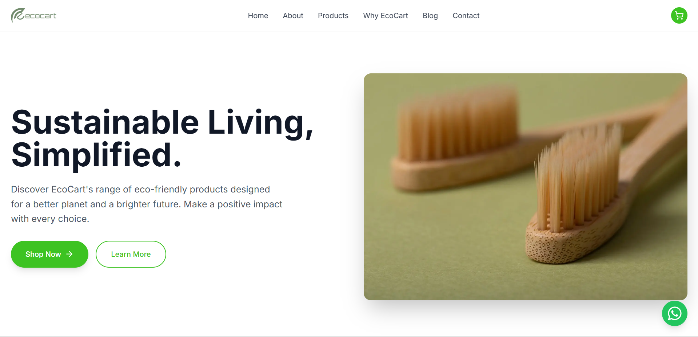

# EcoCart 🛒🌱


A modern, eco-friendly e-commerce platform built with Next.js, designed to promote sustainable living through thoughtfully sourced products.

## 🌟 Features

- **Sustainable Product Catalog**: Browse and purchase eco-friendly products
- **Blog System**: Educational content about sustainability and eco-living
- **Admin Dashboard**: Complete management system for products, blogs, and customer messages
- **Responsive Design**: Mobile-first design with smooth animations
- **Secure Authentication**: JWT-based admin authentication
- **Image Management**: Cloudinary integration for optimized image handling
- **Contact System**: Customer inquiry management
- **Analytics**: Vercel Analytics integration

## 🛠️ Tech Stack

### Frontend
- **Next.js 16** - React framework with App Router
- **React 19** - UI library
- **Tailwind CSS** - Utility-first CSS framework
- **Framer Motion** - Animation library
- **Lucide React** - Icon library

### Backend
- **Next.js API Routes** - Serverless API endpoints
- **MongoDB** - NoSQL database
- **Mongoose** - MongoDB object modeling
- **JWT** - JSON Web Tokens for authentication

### Services
- **Cloudinary** - Image hosting and optimization
- **Vercel Analytics** - Web analytics

## 🚀 Installation

1. **Clone the repository**
   ```bash
   git clone <repository-url>
   cd ecocart
   ```

2. **Install dependencies**
   ```bash
   npm install
   ```

3. **Set up environment variables**

   Create a `.env.local` file in the root directory with the following variables:

   ```env
   # Database
   MONGODB_URI=mongodb://localhost:27017/ecocart

   # JWT Secret
   JWT_SECRET=your-super-secret-jwt-key

   # Cloudinary Configuration
   CLOUDINARY_CLOUD_NAME=your-cloud-name
   CLOUDINARY_API_KEY=your-api-key
   CLOUDINARY_API_SECRET=your-api-secret
   ```

4. **Set up MongoDB**

   Make sure MongoDB is running locally or use a cloud service like MongoDB Atlas.

5. **Run the development server**
   ```bash
   npm run dev
   ```

   The application will be available at `http://localhost:5555`

## 📁 Project Structure

```
ecocart/
├── src/
│   ├── app/                 # Next.js App Router
│   │   ├── api/            # API routes
│   │   ├── admin/          # Admin pages
│   │   ├── blog/           # Blog pages
│   │   └── products/       # Product pages
│   ├── components/         # React components
│   ├── context/            # React context providers
│   ├── lib/                # Utility libraries
│   ├── middleware/         # Next.js middleware
│   └── models/             # MongoDB models
├── public/                 # Static assets
└── package.json
```

## 🔧 API Endpoints

### Products
- `GET /api/products` - Get all products
- `POST /api/products` - Create new product (Admin)
- `GET /api/products/[id]` - Get product by ID
- `PUT /api/products/[id]` - Update product (Admin)
- `DELETE /api/products/[id]` - Delete product (Admin)

### Blogs
- `GET /api/blogs` - Get all blog posts
- `POST /api/blogs` - Create new blog post (Admin)
- `GET /api/blogs/[id]` - Get blog post by ID
- `PUT /api/blogs/[id]` - Update blog post (Admin)
- `DELETE /api/blogs/[id]` - Delete blog post (Admin)
- `GET /api/blogs/slug/[slug]` - Get blog post by slug

### Messages
- `GET /api/messages` - Get all messages (Admin)
- `POST /api/messages` - Send new message
- `DELETE /api/messages/[id]` - Delete message (Admin)

### Admin
- `POST /api/admin/login` - Admin login
- `GET /api/admin/verify` - Verify admin token

### Upload
- `POST /api/upload` - Upload image to Cloudinary

## 👨‍💼 Admin Features

Access the admin panel at `/admin/login`

### Dashboard
- Overview of products, blogs, and messages
- Quick action buttons for management

### Product Management
- Add, edit, and delete products
- Upload product images
- Set pricing and descriptions

### Blog Management
- Create and manage blog posts
- SEO-friendly slugs
- Rich content with images

### Message Management
- View customer inquiries
- Delete processed messages

## 🎨 Components

### Main Components
- **Header** - Navigation and cart
- **Hero** - Landing section
- **Products** - Product catalog
- **About** - Company information
- **BlogSection** - Featured blog posts
- **Contact** - Contact form
- **Footer** - Site footer

### Admin Components
- **AdminProtected** - Route protection
- **AdminSidebar** - Admin navigation

## 🔐 Authentication

Admin authentication uses JWT tokens stored in localStorage. The middleware protects admin routes by verifying the token.

## 📱 Responsive Design

The application is fully responsive and optimized for:
- Mobile devices
- Tablets
- Desktop computers

## 🚀 Deployment

### Vercel (Recommended)
1. Connect your GitHub repository to Vercel
2. Add environment variables in Vercel dashboard
3. Deploy automatically on push

### Other Platforms
The app can be deployed to any platform supporting Next.js:
- Netlify
- Railway
- DigitalOcean App Platform

## 🤝 Contributing

1. Fork the repository
2. Create a feature branch (`git checkout -b feature/amazing-feature`)
3. Commit your changes (`git commit -m 'Add amazing feature'`)
4. Push to the branch (`git push origin feature/amazing-feature`)
5. Open a Pull Request

---

Made with ❤️ for a greener planet